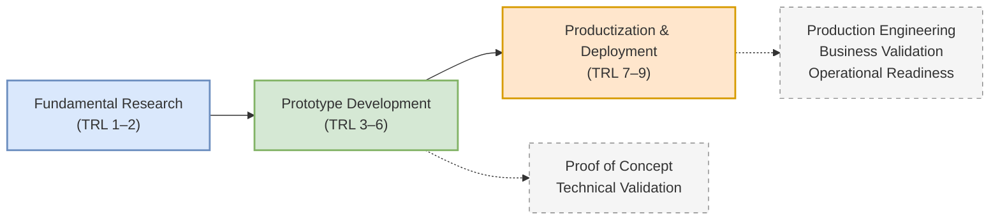

Your article is already well-organized and academically sound. The main opportunity for improvement is not adding more content, but making it read like a polished technical blog rather than a research report. Below are the key areas I would improve:

* A stronger introduction that immediately answers *why readers should care*.
* More natural transitions between sections.
* Better distinction between *research prototype*, *engineering prototype*, and *commercial product*.
* More precise terminology regarding TRL (avoiding the impression that TRL alone determines product readiness).
* More concise writing by removing repetitive explanations.
* A clearer discussion of software-specific concerns such as maintainability, scalability, security, DevOps, observability, and technical debt.
* A more actionable conclusion.

---

# Demystifying Software Evolution: From Prototype to Product in Information Systems

Many software projects begin with a promising idea. Some become successful products that serve thousands—or even millions—of users. Others never progress beyond a proof of concept.

One reason is the widespread misunderstanding of two seemingly similar terms: **prototype** and **product**. In Information Systems (IS) and Software Engineering, they represent fundamentally different stages of technological maturity. A prototype demonstrates that an idea *can* work; a product demonstrates that it *can continuously deliver value* under real-world conditions.

Understanding this distinction is essential for researchers, software engineers, startup founders, and project managers. It influences technical decisions, funding strategies, research evaluation, and commercialization pathways.

This article explains the journey from prototype to product through the lens of the **Technology Readiness Level (TRL)** framework, while highlighting the engineering, organizational, and business considerations required to transform experimental software into enterprise-ready systems.

---

# 1. Prototype vs. Product

Although both are software artifacts, prototypes and products serve fundamentally different purposes.

A **prototype** is an experimental implementation created to validate ideas, reduce technical uncertainty, and evaluate feasibility. It prioritizes learning over completeness. Prototypes are often developed within laboratories, research projects, pilot studies, or limited deployments, where rapid iteration is more important than robustness.

A **product**, on the other hand, is software that has matured beyond experimentation. It is engineered for reliability, maintainability, scalability, security, and long-term operation. A product is expected to satisfy real users consistently while delivering measurable organizational or commercial value.

The difference can be summarized as follows:

| Prototype                       | Product                                      |
| ------------------------------- | -------------------------------------------- |
| Validates technical feasibility | Delivers sustained user value                |
| Built for experimentation       | Built for production                         |
| Limited users                   | Broad user base                              |
| Temporary implementation        | Long-term maintainable system                |
| Technical success               | Technical, operational, and business success |

The transition from prototype to product is therefore much more than additional programming. It represents a shift in engineering philosophy—from *"Can we build it?"* to *"Can we operate, maintain, and sustain it?"*

---

# 2. Understanding Technology Readiness Levels (TRL)

Technology Readiness Levels (TRLs) provide a structured framework for assessing the maturity of a technology. Originally developed by NASA, the framework has since been widely adopted by governments, research institutions, and industry.

For software-intensive Information Systems, TRLs should not be interpreted solely as measures of coding progress. They also reflect increasing confidence in technical performance, operational suitability, and deployment readiness.

## Prototype Stage (TRL 3–6)

At these levels, development focuses on experimentation, validation, and iterative refinement.

### TRL 3 – Proof of Concept

The fundamental concept has been demonstrated through analytical studies or initial experiments. Core technical assumptions have been validated.

### TRL 4 – Component Validation

Individual software components—such as databases, APIs, user interfaces, or machine learning models—are integrated and tested within a controlled laboratory environment.

### TRL 5 – Validation in a Relevant Environment

The prototype is evaluated in an environment that approximates real-world conditions. External data, representative users, or simulated operational workloads are introduced.

### TRL 6 – Demonstration in a Relevant Environment

A complete prototype demonstrates end-to-end functionality in conditions closely resembling operational deployment. At this stage, technical feasibility has largely been established, although the system is not yet production-ready.

---

## Product Stage (TRL 7–9)

The emphasis shifts from proving functionality to ensuring operational excellence.

### TRL 7 – Operational Demonstration

The software is deployed in an operational environment where real users interact with live systems. Integration with external services, authentication mechanisms, and production databases becomes essential.

### TRL 8 – Complete and Qualified System

The software has undergone comprehensive verification and validation. Functional correctness, performance, security, reliability, and deployment procedures have been formally evaluated.

### TRL 9 – Operationally Proven System

The technology has demonstrated sustained success in routine operation. Maintenance processes, monitoring, upgrades, user support, and continuous improvement are all established.

---

# 3. Productization: More Than Better Code

Reaching TRL 6 is an important technical milestone, but it does not automatically produce a viable product. Productization requires advances in several complementary dimensions.

## Engineering Excellence

Production software must satisfy qualities that are often unnecessary in research prototypes, including:

* scalability
* reliability
* security
* maintainability
* observability and monitoring
* automated testing
* deployment automation (CI/CD)
* disaster recovery and backup
* documentation

These characteristics determine whether a system can operate reliably over months or years rather than days or weeks.

---

## Business Viability

Technical excellence alone rarely guarantees adoption.

A successful product requires a sustainable value proposition supported by:

* market analysis
* customer segmentation
* pricing or funding strategy
* stakeholder analysis
* competitive positioning
* long-term operational planning

Tools such as the **Business Model Canvas (BMC)** help translate technical innovation into sustainable organizational or commercial value.

---

## Evidentiary Deliverables

As technology matures, informal demonstrations must be replaced by verifiable evidence.

Typical deliverables include:

* software architecture documentation
* system design specifications
* API documentation
* functional testing reports
* performance benchmarks
* security assessments
* user acceptance testing
* deployment and maintenance guides

These artifacts provide confidence that the software is suitable for production environments.

---

## Socio-Technical Readiness

Information Systems exist within organizations, not in isolation.

Successful deployment depends on factors beyond software quality, including:

* organizational processes
* governance
* regulations
* user acceptance
* training
* change management
* operational policies

Consequently, technology readiness should be considered alongside organizational and social readiness.

---

# 4. Case Study: Disaster Early Warning and Public Reporting System

Consider the development of a Geographic Information System (GIS) for disaster early warning and public reporting.

## Prototype (TRL 3–6)

A university research team develops a web application that allows citizens to report disasters using geotagged photographs.

At TRL 4, the team validates the data ingestion pipeline using Python scripts and a local PostgreSQL database.

By TRL 6, emergency management officers evaluate the prototype in a pilot deployment. The application successfully demonstrates that crowdsourced reporting is technically feasible.

However, several production concerns remain unresolved:

* limited scalability
* minimal security controls
* no disaster recovery procedures
* incomplete documentation
* no operational funding model

The prototype has proven the concept—but not its long-term viability.

---

## Product (TRL 7–9)

To become a production system, the project undergoes substantial engineering and organizational transformation.

The team:

* redesigns the system architecture for high availability;
* performs functional, performance, and security testing;
* implements monitoring and automated deployment pipelines;
* prepares comprehensive technical documentation;
* develops a Business Model Canvas to support sustainable funding through government agencies and NGO partnerships.

At TRL 9, the platform supports thousands of concurrent users, integrates with official emergency response systems, and provides measurable public value through reliable day-to-day operation.

The technology has evolved from an experimental prototype into a dependable Information System.

---

# 5. Visualizing the Journey

The figure below summarizes the progression from research to production.



---

# 6. Key Takeaways

A prototype demonstrates that an idea works. A product demonstrates that the idea can deliver reliable, sustainable value in the real world.

The transition between these stages is not defined solely by additional features or cleaner code. It requires advances in software engineering practices, operational readiness, organizational adoption, and business sustainability.

The Technology Readiness Level framework provides a useful roadmap for measuring technical maturity, but successful productization extends beyond TRL alone. It requires robust engineering, rigorous validation, comprehensive documentation, and a clear strategy for long-term operation.

For researchers, understanding this distinction helps bridge the gap between academic innovation and real-world impact. For software practitioners, it provides a practical framework for transforming promising prototypes into production-ready Information Systems that users can trust and organizations can sustain.

---

## Additional Recommendations

If your target audience is software engineers, researchers, and graduate students, I would also consider adding:

1. **A "Common Misconceptions" section**, e.g., "A working demo is not a product."
2. **A maturity comparison table** (Prototype vs MVP vs Pilot vs Product), which is a distinction many readers seek.
3. **A "Productization Checklist"** with 15–20 items (security, CI/CD, monitoring, documentation, backups, legal compliance, etc.). This would make the article more practical and shareable.
4. **References to ISO/IEC 25010 (Software Quality Model)** and **DevOps practices**, which complement TRL by addressing software quality and operational readiness. These additions would strengthen the article's relevance for modern software engineering.

## References

* **Mankins, J. C. (1995).** *Technology Readiness Levels*. Advanced Concepts Office, Office of Space Access and Technology, NASA. (A foundational text defining the standard TRL framework).
* **Hevner, A. R., March, S. T., Park, J., & Ram, S. (2004).** *Design Science in Information Systems Research*. MIS Quarterly, 28(1), 75-105. (Critical guidelines for developing and evaluating IT artifacts and prototypes in IS).
* **Sommerville, I. (2015).** *Software Engineering* (10th ed.). Pearson. (Comprehensive standards on transitioning software from conceptual models to mature, maintained systems).
```