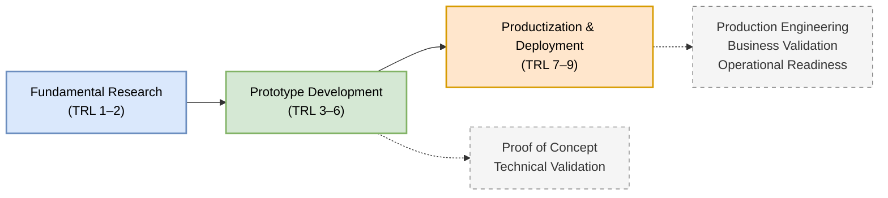

Many software projects begin with a promising idea. Some become successful products that serve thousands—or even millions—of users. Others never progress beyond a proof of concept.

One reason is the widespread misunderstanding of two seemingly similar terms: **prototype** and **product**. In Information Systems (IS) and Software Engineering, they represent fundamentally different stages of technological maturity. A prototype demonstrates that an idea *can* work; a product demonstrates that it *can continuously deliver value* under real-world conditions.

Understanding this distinction is essential for researchers, software engineers, startup founders, and project managers. It influences technical decisions, funding strategies, research evaluation, and commercialization pathways.

This article explains the journey from prototype to product through the lens of the **Technology Readiness Level (TRL)** framework, while highlighting the engineering, organizational, and business considerations required to transform experimental software into enterprise-ready systems.

---

# 1. Prototype vs. Product

Although both are software artifacts, prototypes and products serve fundamentally different purposes.

A **prototype** is an experimental implementation created to validate ideas, reduce technical uncertainty, and evaluate feasibility. It prioritizes learning over completeness. Prototypes are often developed within laboratories, research projects, pilot studies, or limited deployments, where rapid iteration is more important than robustness.

A **product**, on the other hand, is software that has matured beyond experimentation. It is engineered for reliability, maintainability, scalability, security, and long-term operation. A product is expected to satisfy real users consistently while delivering measurable organizational or commercial value.

## 1.1 Common Misconceptions

When transitioning ideas from the laboratory to the enterprise, several pervasive myths often derail projects:

* **Misconception 1: "A working demo is a product."** Often seen in academic environments or student capstone projects, a system might work perfectly on a local machine with a clean dataset. However, a demo lacks the error handling, concurrency management, and security architecture required to survive in the wild. A demo shows the "happy path"; a product handles the edge cases.
* **Misconception 2: "Productization is just cleaning up the code."**
  Refactoring is necessary, but productization is a socio-technical process. It requires establishing a business model, ensuring legal compliance, setting up user support channels, and creating operational governance.
* **Misconception 3: "Reaching TRL 9 means development stops."**
  Software is never truly "finished." A mature product requires continuous maintenance, security patching, and adaptation to underlying infrastructure changes to prevent software rot.

## 1.2 Maturity Comparison: Prototype vs. MVP vs. Pilot vs. Product

To further clarify terminology, it is helpful to contrast a prototype with other common deployment stages.

| Characteristic | Prototype | Minimum Viable Product (MVP) | Pilot | Product |
| :--- | :--- | :--- | :--- | :--- |
| **Primary Goal** | Validate *technical* feasibility. | Validate *business/market* viability. | Test *operational* rollout in a limited scope. | Deliver *sustained value* at scale. |
| **User Base** | Internal team, lab testers. | Early adopters, targeted users. | Specific department or regional branch. | Broad target market. |
| **Completeness** | Only core mechanisms work. | Core value proposition features only. | Fully featured, but artificially restricted scope. | Feature-complete, robust, and supported. |
| **Quality Standard** | "Duct tape and wire" acceptable. | "Good enough" to test the market hypothesis. | Production-grade, but highly monitored. | High reliability (ISO/IEC 25010 standards). |

The transition from prototype to product is therefore much more than additional programming. It represents a shift in engineering philosophy—from *"Can we build it?"* to *"Can we operate, maintain, and sustain it?"*

---

# 2. Understanding Technology Readiness Levels (TRL)

Technology Readiness Levels (TRLs) provide a structured framework for assessing the maturity of a technology. Originally developed by NASA, the framework has since been widely adopted by governments, research institutions, and industry.

For software-intensive Information Systems, TRLs should not be interpreted solely as measures of coding progress. They also reflect increasing confidence in technical performance, operational suitability, and deployment readiness.

## Prototype Stage (TRL 3–6)

At these levels, development focuses on experimentation, validation, and iterative refinement.

* **TRL 3 – Proof of Concept:** The fundamental concept has been demonstrated through analytical studies or initial experiments. Core technical assumptions have been validated.
* **TRL 4 – Component Validation:** Individual software components—such as databases, APIs, user interfaces, or machine learning models—are integrated and tested within a controlled laboratory environment.
* **TRL 5 – Validation in a Relevant Environment:** The prototype is evaluated in an environment that approximates real-world conditions. External data, representative users, or simulated operational workloads are introduced.
* **TRL 6 – Demonstration in a Relevant Environment:** A complete prototype demonstrates end-to-end functionality in conditions closely resembling operational deployment. At this stage, technical feasibility has largely been established, although the system is not yet production-ready.

---

## Product Stage (TRL 7–9)

The emphasis shifts from proving functionality to ensuring operational excellence.

* **TRL 7 – Operational Demonstration:** The software is deployed in an operational environment where real users interact with live systems. Integration with external services, authentication mechanisms, and production databases becomes essential.
* **TRL 8 – Complete and Qualified System:** The software has undergone comprehensive verification and validation. Functional correctness, performance, security, reliability, and deployment procedures have been formally evaluated.
* **TRL 9 – Operationally Proven System:** The technology has demonstrated sustained success in routine operation. Maintenance processes, monitoring, upgrades, user support, and continuous improvement are all established.

---

# 3. Productization: More Than Better Code

Reaching TRL 6 is an important technical milestone, but it does not automatically produce a viable product. Productization requires advances in several complementary dimensions, highly influenced by industry standards like the **ISO/IEC 25010 Software Quality Model** and **DevOps** practices.

## 3.1 Engineering Excellence and Software Quality (ISO/IEC 25010)

Production software must satisfy rigorous quality characteristics defined by the ISO/IEC 25010 standard, which are often ignored during prototyping:

* **Functional Suitability:** Does the system meet all stated user requirements under various conditions?
* **Performance Efficiency:** Can the architecture handle concurrent load?
* **Compatibility:** Does it integrate seamlessly with legacy enterprise systems?
* **Usability:** Is the interface accessible and intuitive for the target demographic?
* **Reliability & Security:** Does the system provide fault tolerance, recoverability, and strict access controls?
* **Maintainability:** Is the codebase modular, well-documented, and testable?

## 3.2 Operational Readiness (DevOps Practices)

Transitioning to TRL 8 and 9 demands the implementation of DevOps methodologies. A prototype might be deployed manually by a single developer; a product relies on automated, repeatable processes. This includes establishing Continuous Integration/Continuous Deployment (CI/CD) pipelines, container orchestration (e.g., leveraging Kubernetes for scalability), automated testing, and comprehensive observability (logging, metrics, and tracing).

## 3.3 Business Viability & Socio-Technical Readiness

Technical excellence alone rarely guarantees adoption. A successful product requires a sustainable value proposition supported by:
* Market analysis and customer segmentation.
* Pricing strategies or long-term public funding models.
* Organizational change management, training, and governance.

Tools such as the **Business Model Canvas (BMC)** help translate technical innovation into sustainable organizational or commercial value.

---

# 4. The 20-Point Productization Checklist

To bridge the gap between a TRL 6 prototype and a TRL 9 product, engineering teams should evaluate their system against this comprehensive checklist:

**Infrastructure & Deployment (DevOps)**
- [ ] Infrastructure as Code (IaC) is implemented (no manual server configurations).
- [ ] Automated CI/CD pipelines are established for testing and deployment.
- [ ] Containerization (e.g., Docker, Kubernetes) is utilized for consistent staging and production environments.
- [ ] Automated scaling policies (horizontal/vertical) are defined based on load.

**Data & State Management**
- [ ] Production databases (e.g., PostgreSQL, BigQuery) are optimized with appropriate indexing and relational integrity.
- [ ] Automated, tested backup and restore procedures are in place.
- [ ] Database migration scripts are version-controlled.
- [ ] Data retention and archiving policies are implemented.

**Security & Compliance**
- [ ] Data in transit (TLS/HTTPS) and data at rest are encrypted.
- [ ] Role-Based Access Control (RBAC) and robust authentication (e.g., OAuth2, JWT) are enforced.
- [ ] Vulnerability scanning and penetration testing have been conducted.
- [ ] Compliance with relevant legal and privacy frameworks (e.g., GDPR, local data protection laws) is verified.

**Quality Assurance & Observability**
- [ ] High test coverage exists across unit, integration, and end-to-end tests.
- [ ] Centralized logging and error tracking (e.g., Sentry, ELK stack) are active.
- [ ] System health monitoring and alerting (e.g., Prometheus, Grafana) notify administrators of downtime or bottlenecks.
- [ ] Performance and load testing (stress testing) have validated the system's operational limits.

**Documentation & Business Continuity**
- [ ] API documentation (e.g., Swagger/OpenAPI) is complete and accurate.
- [ ] End-user manuals and technical administrator guides are published.
- [ ] A formalized Service Level Agreement (SLA) and incident response plan are established.
- [ ] The Business Model Canvas (BMC) or operational funding model is approved.

---

# 5. Case Study: Disaster Early Warning and Public Reporting System

Consider the development of a Geographic Information System (GIS) for disaster early warning and public reporting (similar to the SUAR application model).

## Prototype (TRL 3–6)

A university research team develops a web application that allows citizens to report disasters using geotagged photographs. At TRL 4, the team validates the data ingestion pipeline using Python scripts and a local PostgreSQL database. By TRL 6, forestry and emergency management officers evaluate the prototype in a pilot deployment. The application successfully demonstrates that crowdsourced reporting is technically feasible.

However, several production concerns remain unresolved: limited scalability, minimal security controls, no disaster recovery procedures, incomplete documentation, and no operational funding model. The prototype has proven the concept—but not its long-term viability.

## Product (TRL 7–9)

To become a production system, the project undergoes substantial engineering and organizational transformation. The team:
* Redesigns the system architecture for high availability, utilizing container orchestration.
* Performs rigorous ISO/IEC 25010-aligned functional, performance, and security testing.
* Implements DevOps monitoring and automated deployment pipelines.
* Prepares comprehensive technical blueprints and documentation.
* Develops a Business Model Canvas and drafts Memorandums of Agreement (PKS) with regional government agencies to secure long-term sustainability.

At TRL 9, the platform supports thousands of concurrent users, integrates with official emergency response systems, and provides measurable public value through reliable day-to-day operation. The technology has evolved from an experimental prototype into a dependable Information System.

---

# 6. Visualizing the Journey

The figure below summarizes the progression from research to production.

---

# 7. Key Takeaways

A prototype demonstrates that an idea works. A product demonstrates that the idea can deliver reliable, sustainable value in the real world.

The transition between these stages is not defined solely by additional features or cleaner code. It requires advances in software engineering practices, operational readiness, organizational adoption, and business sustainability.

The Technology Readiness Level framework provides a useful roadmap for measuring technical maturity, but successful productization extends beyond TRL alone. It requires robust engineering aligned with standards like ISO/IEC 25010, modern DevOps workflows, rigorous validation, comprehensive documentation, and a clear strategy for long-term operation.

For researchers, understanding this distinction helps bridge the gap between academic innovation and real-world impact. For software practitioners, it provides a practical framework for transforming promising prototypes into production-ready Information Systems that users can trust and organizations can sustain.

---

# References

* **Hevner, A. R., March, S. T., Park, J., & Ram, S. (2004).** *Design Science in Information Systems Research*. MIS Quarterly, 28(1), 75-105. (Critical guidelines for developing and evaluating IT artifacts and prototypes in IS).
* **ISO/IEC 25010:2023.** *Systems and software engineering — Systems and software Quality Requirements and Evaluation (SQuaRE) — Product quality model.* International Organization for Standardization.
* **Mankins, J. C. (1995).** *Technology Readiness Levels*. Advanced Concepts Office, Office of Space Access and Technology, NASA. (A foundational text defining the standard TRL framework).
* **Sommerville, I. (2015).** *Software Engineering* (10th ed.). Pearson. (Comprehensive standards on transitioning software from conceptual models to mature, maintained systems, including DevOps and agile practices).