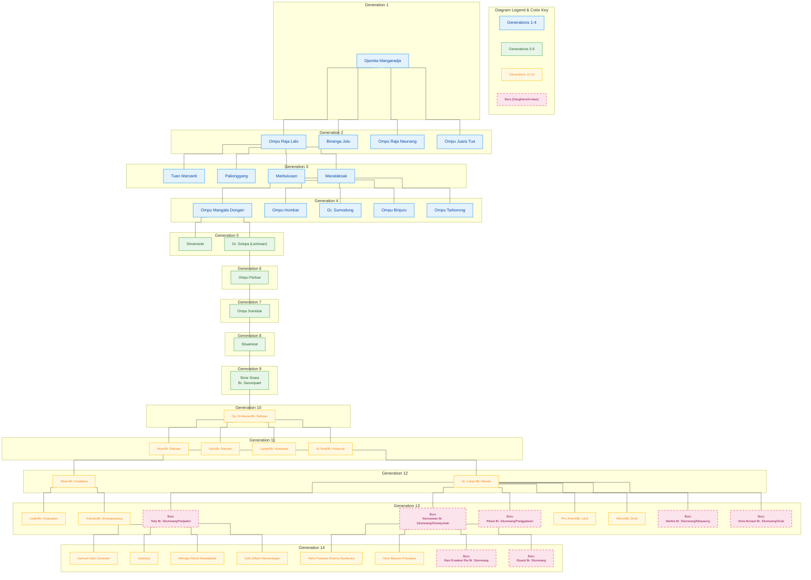

In Batak genealogy, the Situmeang (*Surat Batak*: ᯘᯪᯖᯮᯔᯩᯀᯰ) clan is part of the lineage of **Naipospos**. This clan was inherited directly by **Naipospos' fourth son, Jamita Mangaraja**. Situmeang is included in the lineage of **Naipospos' descendants**, along with the Sibagariang, Hutauruk, Simanungkalit, Marbun Lumbanbatu, Marbun Banjarnahor, and Marbun Lumbangaol clans.

If you look at the birth order of **Naipospos' sons**, the first was **Donda Hopol** (Sibagariang) from his first wife, followed by **Marbun** from his second wife. Three more sons were born to his first wife: **Donda Ujung** (Hutauruk), **Ujung Tinumpak** (Simanungkalit), and finally **Jamita Mangaraja** (Situmeang). However, tradition in most Batak regions always lists descendants from the first wife to the second wife when writing genealogies (tarombo) if someone has children from multiple wives.

